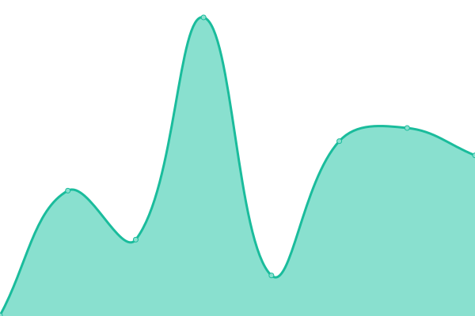
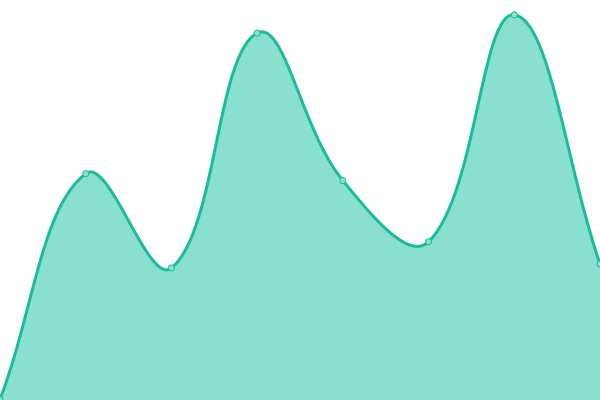
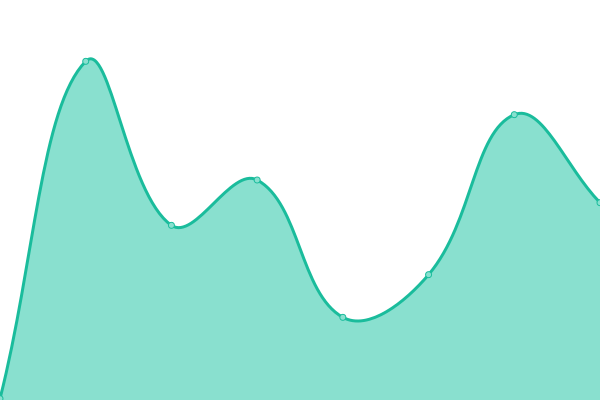
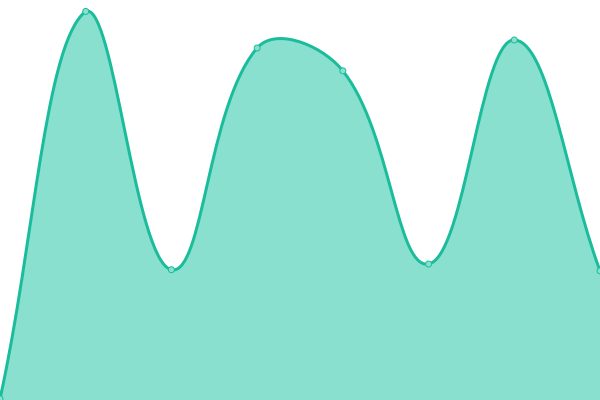

# [📈 Live Status](https://status.haglund.dev): <!--live status--> **🟩 All systems operational**

This repository contains the open-source uptime monitor and status page for [Adam Haglund](https://status.haglund.dev), powered by [Upptime](https://github.com/upptime/upptime).

With [Upptime](https://upptime.js.org), you can get your own unlimited and free uptime monitor and status page, powered entirely by a GitHub repository. We use [Issues](https://github.com/BeeeQueue/upptime/issues) as incident reports, [Actions](https://github.com/BeeeQueue/upptime/actions) as uptime monitors, and [Pages](https://status.haglund.dev) for the status page.

<!--start: status pages-->
<!-- This summary is generated by Upptime (https://github.com/upptime/upptime) -->
<!-- Do not edit this manually, your changes will be overwritten -->
<!-- prettier-ignore -->
| URL | Status | History | Response Time | Uptime |
| --- | ------ | ------- | ------------- | ------ |
|  [arm-server (relations.yuna.moe)](https://relations.yuna.moe/api/ids?id=1337&source=anilist) | 🟩 Up | [arm-server-relations-yuna-moe.yml](https://github.com/BeeeQueue/upptime/commits/HEAD/history/arm-server-relations-yuna-moe.yml) | 

 726ms
     
 | 

<a href="https://status.haglund.dev/history/arm-server-relations-yuna-moe">100.00%</a>
    

|  [arm-server (arm.haglund.dev)](https://arm.haglund.dev/api/ids?id=1337&source=anilist) | 🟩 Up | [arm-server-arm-haglund-dev.yml](https://github.com/BeeeQueue/upptime/commits/HEAD/history/arm-server-arm-haglund-dev.yml) | 

 567ms
     
 | 

<a href="https://status.haglund.dev/history/arm-server-arm-haglund-dev">100.00%</a>
    

|  [dota-matches-api](https://dota.haglund.dev/v1/matches) | 🟩 Up | [dota-matches-api.yml](https://github.com/BeeeQueue/upptime/commits/HEAD/history/dota-matches-api.yml) | 

 1516ms
     
 | 

<a href="https://status.haglund.dev/history/dota-matches-api">100.00%</a>
    

|  [stratroulette.net](https://stratroulette.net) | 🟩 Up | [stratroulette-net.yml](https://github.com/BeeeQueue/upptime/commits/HEAD/history/stratroulette-net.yml) | 

 136ms
     
 | 

<a href="https://status.haglund.dev/history/stratroulette-net">100.00%</a>
    

|  [siege.stratroulette.net](https://siege.stratroulette.net/graphql?query=%7Bstrat(shortId%3A2)%7BshortId%7D%7D) | 🟩 Up | [siege-stratroulette-net.yml](https://github.com/BeeeQueue/upptime/commits/HEAD/history/siege-stratroulette-net.yml) | 

 434ms
     
 | 

<a href="https://status.haglund.dev/history/siege-stratroulette-net">100.00%</a>
    

<!--end: status pages-->

[**Visit our status website →**](https://status.haglund.dev)

## 📄 License

- Powered by: [Upptime](https://github.com/upptime/upptime)
- Code: [MIT](./LICENSE) © [Adam Haglund](https://status.haglund.dev)
- Data in the `./history` directory: [Open Database License](https://opendatacommons.org/licenses/odbl/1-0/)
